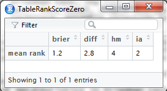
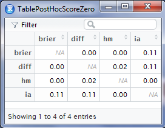
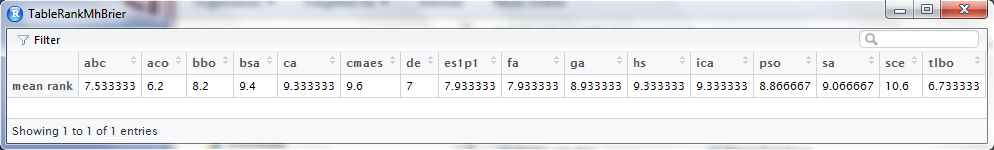
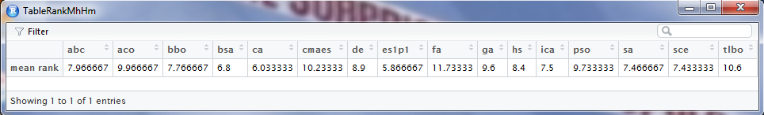
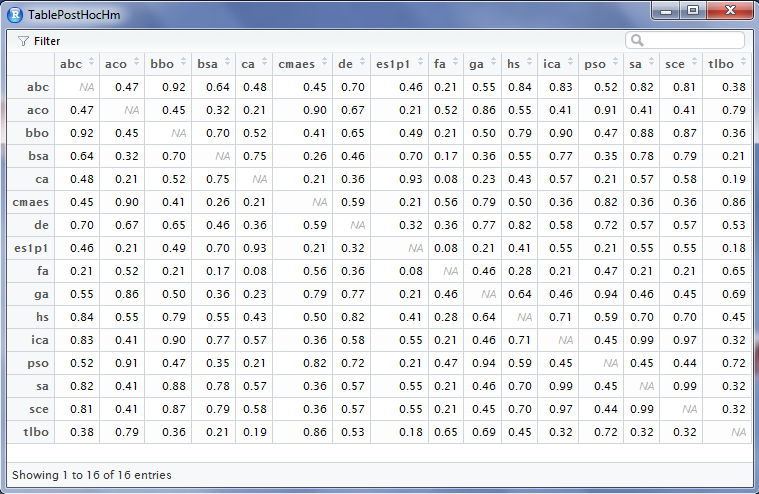
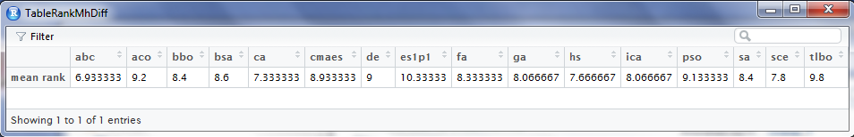
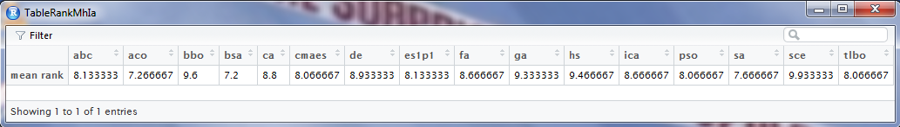

[](http://quantlet.de/index.php?p=info)

## [](http://quantlet.de/) **MHEEnsembleEvaluation** [](http://quantlet.de/d3/ia)

```yaml

Name of QuantLet : MHEEnsembleEvaluation

Published in : 'MHE - Performance Analysis and Comparison of Metaheuristics for Generating
Ensembles of Classifiers'

Description : 'Accumulates outputs of MHEMetaheuristicEnsembles and performs test set predictions
of ensembles. Predictions are tested for differences among scores and among metaheuristics by means
of the Friedman test. The four best metaheuristics are compared to best base model, simple average
ensemble, greedy optimization technique, ensemble selection and LASSO regression.'

Inputs : 'A string path for the initial working directory. This working directory must contain a
folder named datasets in which data sets in .txt-format are stored, and another folder named
predictions that contains outputs produced by MHEModelClassifiers and MHEMetaheuristicEnsembles.'

Output : 'MHEEnsembleEvaluation_01 - Mean ranks of scores in Friedman test regarding score
differences in AUC MHEEnsembleEvaluation_02 - Boxplots of scores regarding computation time
MHEEnsembleEvaluation_03 - Corrected p-values in post hoc test regarding AUC
MHEEnsembleEvaluation_04 - Mean ranks of scores in Friedman test regarding computation time
MHEEnsembleEvaluation_05 - Mean ranks of scores in Friedman test regarding sparsity
MHEEnsembleEvaluation_06 - Corrected p-values in post hoc test regarding differences of scores in
sparsity MHEEnsembleEvaluation_07 - Boxplots of scores regarding percentage of zero weights
MHEEnsembleEvaluation_08 - Boxplots of metaheuristics regarding computation time
MHEEnsembleEvaluation_09 - Mean ranks of metaheuristics in Friedman test regarding Brier score
MHEEnsembleEvaluation_10 - Mean ranks of metaheuristics in Friedman test regarding H-measure
MHEEnsembleEvaluation_11 - Corrected p-values in post hoc test regarding differences of
metaheuristics in H-measure MHEEnsembleEvaluation_12 - Mean ranks of metaheuristics in Friedman
test regarding difficulty MHEEnsembleEvaluation_13 - Mean ranks of metaheuristics in Friedman test
regarding interrater agreement MHEEnsembleEvaluation_14 - Mean ranks of metaheuristics in Friedman
test regarding computation time MHEEnsembleEvaluation_15 - Mean ranks of metaheuristics in Friedman
test regarding percentage of zero weights MHEEnsembleEvaluation_16 - Corrected p-values in post hoc
test regarding differences of metaheuristics in computation time MHEEnsembleEvaluation_17 -
Corrected p-values in post hoc test regarding differences of metaheuristics in sparsity
MHEEnsembleEvaluation_18 - Boxplots of metaheuristics regarding percentage of zero weights
MHEEnsembleEvaluation_19 - Table of best metaheuristics compared to other techniques based on Brier
score relative to global optimum.'

Keywords : 'data mining, Testing, LASSO, classification, statistics, machine learning, ensemble of
classifiers, metaheuristic'

See also : MHEModelClassifiers, MHEMetaheuristicEnsembles

Author : Ringolf Thomschke

Datafile : datasets, predictions

```


















### R Code:
```r
####################### INPUT
path = "C:/Users/"

####################### load packages
pack = c("caret", "AUC", "hmeasure", "R.matlab", "glmnet", "scmamp", "xtable")

lapply(pack, function(x) if (!(x %in% installed.packages())) {
  install.packages(x)
})

lapply(pack, library, character.only = TRUE)

####################### fitness functions 

#Brier score // minimize // obs as num
fn_brier = function(w, pred, obs) {
  wnow        = w/sum(w)
  weightedSum = rowSums(sweep(pred, MARGIN = 2, STATS = wnow, FUN = "*"))
  brierScore  = 1/length(obs) * sum((weightedSum - obs)^2)
  return(brierScore)
}

# Area under ROC // maximize // obs as cat
fn_auc = function(w, pred, obs) {
  wnow        = w/sum(w)
  weightedSum = rowSums(sweep(pred, MARGIN = 2, STATS = wnow, FUN = "*"))
  auroc       = AUC::auc(AUC::roc(weightedSum, obs))
  return(auroc)
}

# H-measure // maximize // obs as cat
fn_hmeasure = function(w, pred, obs) {
  wnow        = w/sum(w)
  weightedSum = rowSums(sweep(pred, MARGIN = 2, STATS = wnow, FUN = "*"))
  hm          = as.vector(unlist(HMeasure(obs, weightedSum)$metrics[1]))
  return(hm)
}

# Difficulty // minimize // obs as num
fn_diff = function(w, pred, obs) {
  wnow = round(w/sum(w), 3)
  ind  = which(wnow > 0)
  pred = round(pred)[, ind]
  if (length(ind) > 1) {
    # proportion of correct classifiers
    x = (ncol(pred) - rowSums(abs(pred - obs)))/ncol(pred)
  } else {
    x = 1 - abs(pred - obs)
  }
  return(var(x))
}

# Iterater Agreement // minimize // obs as num
fn_ia = function(w, pred, obs) {
  wnow = round(w/sum(w), 3)
  ind  = which(wnow > 0)
  pred = round(pred)[, ind]
  p    = 1/(ncol(pred) * nrow(pred)) * sum(nrow(pred) - colSums(abs(pred - obs)))
  rho  = ncol(pred) - rowSums(abs(pred - obs))
  k    = (1/ncol(pred) * sum(rho * (ncol(pred) - rho)))/(nrow(pred) * (ncol(pred) - 
    1) * p * (1 - p))
  return(k)
}

######################### Functions for greedy optimization and ensemble selection 

# brier for greedy optimization
fn_brierGO = function(pred, obs) {
  brierScore = unlist(lapply(pred, function(x) 1/length(obs) * sum((x - obs)^2)))
  return(brierScore)
}

# greedy optimization
greedOpt = function(X, Y, iter = 100L) {
  # X - predictions Y - observations iter - number of iterations
  
  # Initialize Variables
  N           = ncol(X)
  weights     = rep(0L, N)
  pred        = 0 * X
  sum.weights = 0L
  
  while (sum.weights < iter) {
    # No. of Models/Slots in Ensemble
    sum.weights = sum.weights + 1L
    
    # 'Trick': Compute Matrix with predictions of each Candidate-Ensemble
    pred = (pred + X) * (1L/sum.weights)
    
    # Compute Prediction error of Candidate-Ensemble Here: Use our Score Function?
    errors = fn_brierGO(pred, Y)
    
    # Choose Candidate-Ensemble with smallest Error
    best = which.min(errors)
    
    # increase Weight of best Model in Ensemble Model
    weights[best] = weights[best] + 1L
    
    # Correctly weight Prediction (and use only chosen ensemble) for next step
    pred = pred[, best] * sum.weights
  }
  # Return the weight of each of M Models in Ensemble Model
  return(weights/sum.weights)
}


# Function for bagged Ensemble Selection
BES = function(X, Y, b = 10L, p = 0.5, r = 100L) {
  i = 0L
  N = nrow(X)
  M = ncol(X)
  W = matrix(rbinom(b * M, 1, p), ncol = M)
  
  while (i < b) {
    i         = i + 1L
    ind       = which(W[i, ] == 1)
    W[i, ind] = W[i, ind] * greedOpt(X[, ind], Y, r)
  }
  
  return(colSums(W)/b)
}


####################### Gather ensembles 

#save all ensemble information in one data frame for each data set

# set paths
path.data = paste(path, "/datasets", sep = "")
path.pred = paste(path, "/predictions", sep = "")

# list of data sets
setwd(path.pred)
set = list.files()

# loop over data sets
for (i in 1:length(set)) {
  setwd(paste(path.pred, "/", set[i], sep = ""))
  files = list.files()
  files = files[which(grepl("ensemble", files))]
  
  # loop over ensembles
  for (j in 1:length(files)) {
    sim     = readMat(paste(path.pred, "/", set[i], "/", files[j], sep = ""))
    simName = gsub(paste(set[i], "-ensemble-", sep = ""), "", files[j])
    simName = gsub(".mat", "", simName)
    simName = unlist(strsplit(simName, "-"))
    
    ensMH      = simName[1]
    ensScore   = simName[2]
    ensWeights = as.vector(sim$ens[[3]])
    ensCost    = as.vector(sim$ens[[2]])
    ensTime    = as.vector(sim$ens[[1]])
    
    ens        = data.frame(ensMH, ensScore, ensCost, ensTime, t(ensWeights))
    names(ens) = c("MH", "Score", "Cost", "Time", as.character(1:length(ensWeights)))
    
    if (j == 1) {
      ensFrame = ens
    } else {
      ensFrame = rbind(ensFrame, ens)
    }
  }
  
  # correct negative value in hm
  ensFrame$Cost = abs(ensFrame$Cost)
  
  # round weights to 4 digits
  ensFrame[, 5:ncol(ensFrame)] = sapply(ensFrame[, 5:ncol(ensFrame)], function(x) round(x, 
    4))
  # round cost to 6 digits
  ensFrame[, "Cost"] = sapply(ensFrame[, "Cost"], function(x) round(x, 6))
  # round time to 1 digit
  ensFrame[, "Time"] = sapply(ensFrame[, "Time"], function(x) round(x, 1))
  
  
  # load training set predictions
  predTrain = readRDS(paste(set[i], "-predTrain.rds", sep = ""))
  
  # load test set predictions
  predTest = readRDS(paste(set[i], "-predTest.rds", sep = ""))
  
  
  # get training and test set observations
  namePart = grep("part", list.files())
  part     = readRDS(list.files()[namePart])
  
  setwd(path.data)
  ds = read.table(paste(set[i], ".txt", sep = ""))
  if (is.numeric(ds$class) == TRUE) {
    obs         = factor(ds$class)  #,levels=c('negative','positive'))
    levels(obs) = c("negative", "positive")
    obsTrain    = obs[part]
    obsTrainNum = ds$class[part]
    obsTest     = obs[-part]
    obsTestNum  = ds$class[-part]
  } else {
    obsTrain    = ds$class[part]
    obsTrainNum = as.numeric(obsTrain) - 1
    obsTest     = ds$class[-part]
    obsTestNum  = as.numeric(obsTest) - 1
  }
  
  
  # calculate cost for test set
  CostTest = rep(0, nrow(ensFrame))
  for (j in 1:nrow(ensFrame)) {
    spot = grep("Time", names(ensFrame))
    weightsNow = t(as.vector(ensFrame[j, (spot + 1):ncol(ensFrame)]))
    scoreNow = ensFrame$Score[j]
    
    if (scoreNow == "brier") {
      CostTest[j] = fn_brier(weightsNow, predTest, obsTestNum)
    }
    if (scoreNow == "hm") {
      CostTest[j] = fn_hmeasure(weightsNow, predTest, obsTestNum)
    }
    if (scoreNow == "diff") {
      CostTest[j] = fn_diff(weightsNow, predTest, obsTestNum)
    }
    if (scoreNow == "ia") {
      CostTest[j] = fn_ia(weightsNow, predTest, obsTestNum)
    }
  }
  # insert CostTest into ensFrame
  spot     = which(names(ensFrame) == "Cost")
  ensFrame = data.frame(ensFrame[, 1:spot], data.frame(CostTest), ensFrame[, (spot + 
    1):ncol(ensFrame)])
  
  # calculate AUC for train and test
  AUCTest  = rep(0, nrow(ensFrame))
  AUCTrain = rep(0, nrow(ensFrame))
  for (j in 1:nrow(ensFrame)) {
    spot       = grep("Time", names(ensFrame))
    weightsNow = t(as.vector(ensFrame[j, (spot + 1):ncol(ensFrame)]))
    
    AUCTrain[j] = fn_auc(weightsNow, predTrain, obsTrain)
    AUCTest[j]  = fn_auc(weightsNow, predTest, obsTest)
  }
  
  # insert AUCTest,AUCTrain into ensFrame
  spot     = which(names(ensFrame) == "CostTest")
  ensFrame = data.frame(ensFrame[, 1:spot], data.frame(AUCTrain), data.frame(AUCTest), 
    ensFrame[, (spot + 1):ncol(ensFrame)])
  
  # percentage zero weights
  spot            = grep("Time", names(ensFrame))
  weightsFrame    = ensFrame[, (spot + 1):ncol(ensFrame)]
  numberZeros     = apply(weightsFrame, 1, function(x) length(which(x == 0)))
  percZeroWeights = numberZeros/ncol(weightsFrame)
  spot            = which(names(ensFrame) == "Time")
  ensFrame        = data.frame(ensFrame[, 1:(spot - 1)], data.frame(percZeroWeights), 
    ensFrame[, (spot):ncol(ensFrame)])
  
  # number of base classifiers
  spot     = which(names(ensFrame) == "Time")
  nbc      = length(names(ensFrame)[(spot + 1):ncol(ensFrame)])
  ensFrame = data.frame(ensFrame[, 1:(spot - 1)], data.frame(nbc), ensFrame[, (spot):ncol(ensFrame)])
  
  # save ensemble frame
  setwd(paste(path.pred, "/", set[i], sep = ""))
  saveRDS(ensFrame, paste(set[i], "-ensFrame.rds", sep = ""))
  
  # name ensFrame
  assign(set[i], ensFrame)
}
rm(ens, ensScore, ensCost, ensMH, ensTime, ensWeights, sim, simName, i, j, files, 
  ensFrame, ds, predTest, predTrain, weightsFrame, weightsNow, namePart, nbc, numberZeros, 
  obsTest, obsTestNum, obsTrain, obsTrainNum, AUCTest, AUCTrain, part, percZeroWeights, 
  scoreNow, spot, CostTest, obs)

# stack evaluation results into one big frame
for (i in 1:length(set)) {
  dfNow = get(set[i])
  spot  = which(colnames(dfNow) == "Time")
  dfNow = dfNow[, 1:spot]
  dfNow = data.frame(data.frame(set[i]), dfNow)
  if (i == 1) 
    df  = dfNow else df = rbind(df, dfNow)
}
names(df)[1] = "Dataset"
df$Dataset = factor(df$Dataset)

rm(adult, bank, chess, credit_approval, dfNow, ds, eeg_eye_state, ensFrame, fertility, 
  Gamma_Telescope, heart_disease, ionosphere, pima_indians_diabetes, predTest, 
  predTrain, qsar_biodegradation, seismic_bumps, spambase, statlog_shuttle, weightsFrame, 
  wilt, dfNow, spot, i)

####################### Evaluation

####################### Comparisons among scores 

# Accuracy comparisons amongst scores with AUC
y             = rbind(by(df$AUCTest, list(df$Dataset, df$Score), function(x) mean(x)))
testScore     = friedmanTest(y)
testScorePost = postHocTest(y, use.rank = TRUE)

TableRankScoreAUC           = data.frame(testScorePost$summary)
rownames(TableRankScoreAUC) = "mean rank"
TablePostHocScoreAUC        = data.frame(round(testScorePost$corrected.pval, 2))

# Time comparisons amongst scores
boxplot(log(df$Time) ~ df$Score, col = c("pink", "lightblue", "lightgreen", "lightyellow"), 
  main = "Log time", xlab = "Score", las = 1)

y            = rbind(by(df$Time, list(df$Dataset, df$Score), mean))
testTime     = friedmanTest(y)
testTimePost = postHocTest(data = y, test = "friedman", use.rank = TRUE, correct = "finner")

TableRankScoreTime           = data.frame(testTimePost$summary)
rownames(TableRankScoreTime) = "mean rank"

# percZeroWeigts amongst scores
par(las = 1)
boxplot(df$percZeroWeights ~ df$Score, col = c("pink", "lightblue", "lightgreen", 
  "lightyellow"), main = "Amount of zero weights in %", xlab = "Score", yaxt = "n")
axis(2, at = pretty(df$percZeroWeights), lab = pretty(df$percZeroWeights) * 100, 
  las = TRUE)

y            = rbind(by(df$percZeroWeights, list(df$Dataset, df$Score), mean))
testZero     = friedmanTest(y)
testZeroPost = postHocTest(data = y, use.rank = TRUE)

TableRankScoreZero           = data.frame(testZeroPost$summary)
rownames(TableRankScoreZero) = "mean rank"
TablePostHocScoreZero        = data.frame(round(testZeroPost$corrected.pval, 2))

###################### Comparison of Metaheuristics 

# comparison on Brier score
dfBrier = subset(df, df$Score == "brier")
y       = rbind(by(dfBrier$CostTest, list(dfBrier$Dataset, dfBrier$MH), function(x) x))

testBrier     = friedmanTest(y)
testBrierPost = postHocTest(data = y, test = "friedman", use.rank = TRUE, correct = "finner")

TableRankMhBrier           = data.frame(testBrierPost$summary)
rownames(TableRankMhBrier) = "mean rank"

# Comparisons based on H-measure
dfHm = subset(df, df$Score == "hm")
y    = rbind(by(dfHm$CostTest, list(dfHm$Dataset, dfHm$MH), function(x) x))

testHm     = friedmanTest(y)
testHmPost = postHocTest(data = y, test = "friedman", use.rank = TRUE, correct = "finner")

TableRankMhHm           = data.frame(testHmPost$summary)
rownames(TableRankMhHm) = "mean rank"
TablePostHocMhHm        = data.frame(round(testHmPost$corrected.pval, 2))

# Comparisons based on difficulty
dfDiff = subset(df, df$Score == "diff")
y      = rbind(by(dfDiff$CostTest, list(dfDiff$Dataset, dfDiff$MH), function(x) x))

testDiff     = friedmanTest(y)
testDiffPost = postHocTest(data = y, test = "friedman", use.rank = TRUE, correct = "finner")

TableRankMhDiff           = data.frame(testDiffPost$summary)
rownames(TableRankMhDiff) = "mean rank"

# Comparisons based on interrater agreement
dfIa = subset(df, df$Score == "ia")
y    = rbind(by(dfIa$CostTest, list(dfIa$Dataset, dfIa$MH), function(x) x))

testIa     = friedmanTest(y)
testIaPost = postHocTest(data = y, test = "friedman", use.rank = TRUE, correct = "finner")

TableRankMhIa           = data.frame(testIaPost$summary)
rownames(TableRankMhIa) = "mean rank"

# Comparison based on computation time (only Brier)
boxplot(log(dfBrier$Time) ~ dfBrier$MH, col = "lightyellow", main = "Log time", xlab = "Metaheuristic", 
  las = 1)

y = rbind(by(dfBrier$Time, list(dfBrier$Dataset, dfBrier$MH), function(x) x))

testMHTime     = friedman.test(y)
testMHTimePost = postHocTest(y, use.rank = TRUE)

TableRankMhTime           = data.frame(testMHTimePost$summary)
rownames(TableRankMhTime) = "mean rank"
TablePostHocMhTime        = data.frame(round(testMHTimePost$corrected.pval, 2))

# Comparison of percentage zero weights (only Brier)
boxplot(dfBrier$percZeroWeights ~ dfBrier$MH, col = "lightyellow", main = "Amount of zero weights in %", 
  xlab = "Metaheuristic", yaxt = "n")
axis(2, at = pretty(df$percZeroWeights), lab = pretty(df$percZeroWeights) * 100, 
  las = TRUE)

y = rbind(by(dfBrier$percZeroWeights, list(dfBrier$Dataset, dfBrier$MH), function(x) x))

testMHZero     = friedmanTest(y)
testMHZeroPost = postHocTest(y, use.rank = TRUE)

TableRankMhZero           = data.frame(testMHZeroPost$summary)
rownames(TableRankMhZero) = "mean rank"
TablePostHocMhZero        = data.frame(round(testMHZeroPost$corrected.pval, 2))

######################## comparison to other techniques 

# compare best metaheuristics, best single, logreg, ensemble selection

bmBestTrain      = rep(NA, length(set))
bmBestTest       = rep(NA, length(set))
savgBrierTrain   = rep(NA, length(set))
savgBrierTest    = rep(NA, length(set))
glmnetBrierTrain = rep(NA, length(set))
glmnetBrierTest  = rep(NA, length(set))
globalOptBrier   = rep(NA, length(set))

setwd(path.pred)
set = list.files()
set = set[which(!grepl(".rds", set))]

fn_brierSingle = function(pred, obs) {
  1/length(obs) * sum((pred - obs)^2)
}

for (i in 1:length(set)) {
  setwd(file.path(path.pred, set[i]))
  filesnow  = list.files()
  predTrain = readRDS(paste(set[i], "-predTrain.rds", sep = ""))
  predTest  = readRDS(paste(set[i], "-predTest.rds", sep = ""))
  part      = readRDS(filesnow[which(grepl("part", filesnow))])
  
  setwd(path.data)
  datanow = read.table(paste(set[i], ".txt", sep = ""))
  
  if (is.factor(datanow$class)) {
    obsTrain = as.numeric(datanow$class[part]) - 1
    obsTest  = as.numeric(datanow$class[-part]) - 1
  } else {
    obsTrain = datanow$class[part]
    obsTest  = datanow$class[-part]
  }
  
  # Brier of base models
  bmBrierTrain = sapply(predTrain, function(x) fn_brierSingle(x, obsTrain))
  bmBrierTest  = sapply(predTest, function(x) fn_brierSingle(x, obsTest))
  
  # best Brier
  ind = which.min(bmBrierTrain)
  bmBestTrain[i] = bmBrierTrain[ind]
  bmBestTest[i]  = bmBrierTest[ind]
  
  # simpleAVG
  weightsSimple = rep(1/ncol(predTrain), ncol(predTrain))
  savgBrierTrain[i] = fn_brier(weightsSimple, predTrain, obsTrain)
  savgBrierTest[i]  = fn_brier(weightsSimple, predTest, obsTest)
  
  # LASSO regression
  glmnetTrain         = cv.glmnet(as.matrix(predTrain), obsTrain, family = "binomial", 
                                  type.measure = "mse", nfolds = 5, alpha = 1)
  glmnetPredTrain     = as.vector(predict(glmnetTrain, newx = as.matrix(predTrain), 
                                  s = min(glmnetTrain$lambda), type = "response"))
  glmnetBrierTrain[i] = fn_brierSingle(glmnetPredTrain, obsTrain)
  
  glmnetPredTest      = as.vector(predict(glmnetTrain, newx = as.matrix(predTest), 
                                     s = min(glmnetTrain$lambda), type = "response"))
  glmnetBrierTest[i]  = fn_brierSingle(glmnetPredTest, obsTest)
  
  # global optimum
  globalOpt         = glmnet(as.matrix(predTest), obsTest, family = "binomial", alpha = 1)
  globalOptPred     = as.vector(predict(globalOpt, newx = as.matrix(predTest), 
                                    s = min(globalOpt$lambda), type = "response"))
  globalOptBrier[i] = fn_brierSingle(globalOptPred, obsTest)
}

# merge results
finaldf = cbind.data.frame(set, bmBestTrain, bmBestTest, savgBrierTrain, savgBrierTest, 
  glmnetBrierTrain, glmnetBrierTest, globalOptBrier)

# best MHs
dfBrierBestMH = subset(dfBrier, MH %in% c("sa", "es1p1", "bsa", "ca"))
dfBrierBestMH = cbind(set, dfBrier[which(dfBrier$MH == "sa"), c("Cost", "CostTest")], 
  dfBrier[which(dfBrier$MH == "es1p1"), c("Cost", "CostTest")], 
  dfBrier[which(dfBrier$MH == "bsa"), c("Cost", "CostTest")], 
  dfBrier[which(dfBrier$MH == "ca"), c("Cost", "CostTest")])

names(dfBrierBestMH) = c("set", "saTrain", "saTest", "es1p1Train", "es1p1Test", "bsaTrain", 
  "bsaTest", "caTrain", "caTest")


# greedy optimization and ensemble selection
setwd(path.pred)
resultsES = list()
for (i in 1:length(set)) {
  
  # load observations and predictions for set[i]
  setwd(file.path(path.pred, set[i]))
  f = list.files()
  
  pred.train = f[which(grepl("predTrain.rds", f))]
  pred.train = readRDS(pred.train)
  
  if ("class" %in% names(pred.train)) {
    pred.train = pred.train[, -ncol(pred.train)]  #error in class
  }
  
  pred.test = f[which(grepl("predTest", f))]
  pred.test = readRDS(pred.test)
  
  if ("class" %in% names(pred.test)) {
    pred.test = pred.test[, -ncol(pred.test)]
  }
  part = f[which(grepl("part", f))]
  part = readRDS(part)
  
  setwd(path.data)
  ds = read.table(paste(set[i], ".txt", sep = ""), header = TRUE)
  
  if (is.factor(ds$class)) {
    obs.train = as.numeric(ds$class[part]) - 1
    obs.test  = as.numeric(ds$class[-part]) - 1
    
  } else {
    obs.train = ds$class[part]
    obs.test  = ds$class[-part]
  }
  
  bGO = greedOpt(pred.train, obs.train)
  bES = BES(X = pred.train, Y = obs.train, b = 20)
  
  ens.test        = sweep(pred.test, MARGIN = 2, STATS = bGO, FUN = "*")
  ens.test        = rowSums(ens.test)
  brierEns.testGO = 1/length(obs.test) * sum((ens.test - obs.test)^2)
  ens.test        = sweep(pred.test, MARGIN = 2, STATS = bES, FUN = "*")
  ens.test        = rowSums(ens.test)
  brierEns.testES = 1/length(obs.test) * sum((ens.test - obs.test)^2)
  
  l = list(ds = set[i], weightsGreedy = bGO, brierTestGreedy = brierEns.testGO, 
    weightsES = bES, brierTestES = brierEns.testES)
  
  resultsES[i] = list(l)
}
brierTestGreedy = sapply(resultsES, with, brierTestGreedy)
brierTestES     = sapply(resultsES, with, brierTestES)

# merge results
finaldf            = cbind(dfBrierBestMH, brierTestGreedy, brierTestES, finaldf[, -1])
row.names(finaldf) = NULL


finaldfTest            = finaldf[, c("set", "saTest", "es1p1Test", "bsaTest", "caTest", 
                                     "bmBestTest", "savgBrierTest", "brierTestGreedy", 
                                     "brierTestES", "glmnetBrierTest", "globalOptBrier")]
row.names(finaldfTest) = NULL

# compute scaling to global optimum
ensembleComparison           = (1 - finaldfTest[, c(-1, -ncol(finaldfTest))])/
  (1 - finaldfTest[, ncol(finaldfTest)])
rownames(ensembleComparison) = set
ensembleComparison           = round(ensembleComparison, 4)

# compute mean rank of techniques
avgRank = round(postHocTest(ensembleComparison, use.rank = T)$summary,2)

ensembleComparison                            = rbind(ensembleComparison, avgRank)
rownames(ensembleComparison)[length(set) + 1] = "mean rank"

### END

```
